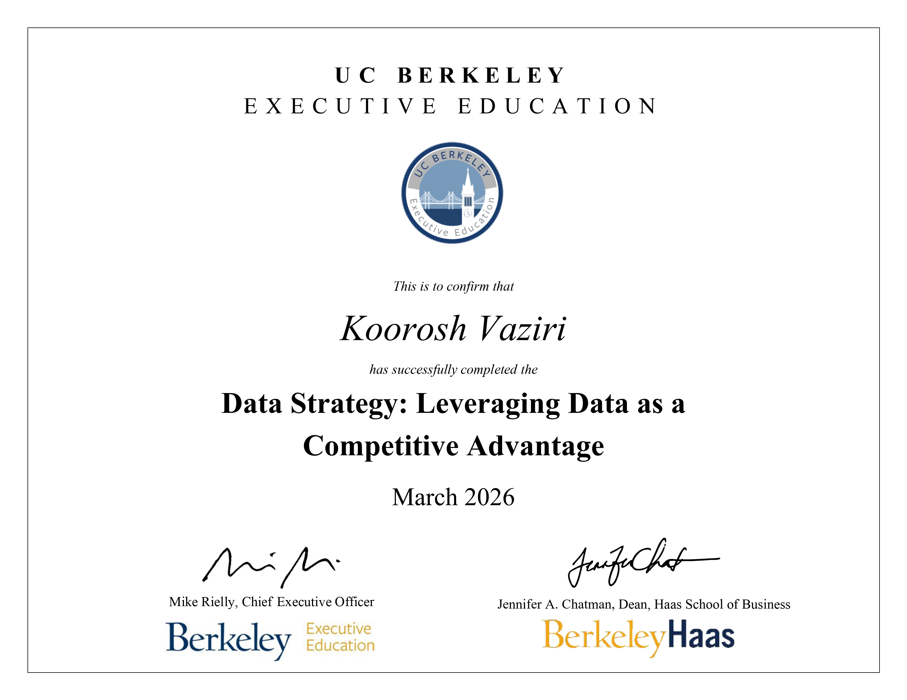

# 📊 Berkeley Data Strategy: Leveraging Data as a Competitive Advantage
### Leveraging Data as a Competitive Advantage

This repository documents my journey through the **UC Berkeley Executive Education** Data Strategy program. This course serves as a bridge between technical data science and executive leadership, focusing on how to treat data as a high-value corporate asset.

## 🎯 Learning Objectives
- **Data-Driven Roadmap:** Building strategic roadmaps to gain industry competitive advantage.
- **Data Lifecycle Management:** Understanding the full journey of data from ingestion to monetization.
- **Governance & Security:** Implementing frameworks for data quality, privacy, and ethical use.
- **Cultural Transformation:** Strategies for building a data-first decision-making culture.

## 🛠️ Key Frameworks
- **The Contextualization Phase:** Analyzing the organizational environment for data strategy.
- **Ideation & Prescription:** Generating data use cases and linking them to implementation plans.

## 💼 Industry Application (Genius Sports)
For the capstone project, the data strategy frameworks, SWOT analysis, and fly-wheel were applied to create a new data infrastructure and products for regional sports leagues and college teams.

* **Note:** Due to the proprietary nature of these organizational strategy documents and cultural assessments, the specific project deliverables remain confidential.

---

*UC Berkeley Professional Certificate: Leading Strategy Execution through Culture*
